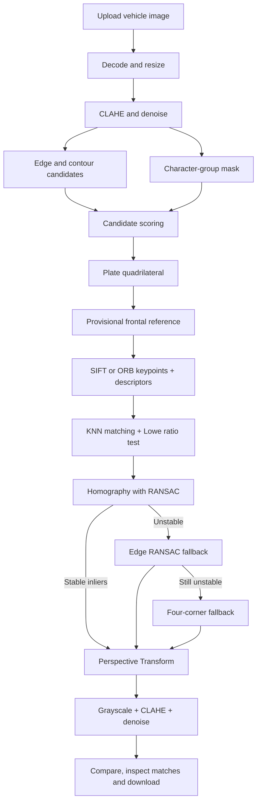

# Project Report Guide

## 1. Project title

**Vehicle License Plate Rectification for OCR Using OpenCV, Homography and RANSAC**

## 2. Problem statement

ภาพป้ายทะเบียนจากรถหรือกล้อง CCTV มักมีมุมเอียง แสงไม่สม่ำเสมอ และสัญญาณรบกวน ทำให้ OCR อ่านตัวอักษรได้ยาก โปรเจกต์นี้จึงตรวจหาป้ายจากภาพรถหนึ่งภาพ ปรับมุมมองให้ตรง และสร้างภาพ Grayscale ที่เพิ่ม Contrast และลด Noise แล้ว

## 3. Objectives

1. ตรวจหาบริเวณป้ายทะเบียนจากภาพรถหนึ่งภาพ
2. หาเส้นขอบและมุมของแผ่นป้าย โดยรองรับป้ายสีและมุมมองที่เอียงมาก
3. ตรวจหา SIFT/ORB keypoints สร้าง descriptors และจับคู่ด้วย KNN + Lowe's ratio test
4. คำนวณ Homography จากคู่จุดด้วย RANSAC พร้อมตัด outlier
5. ใช้ Perspective Transform เพื่อสร้างภาพป้ายที่มองตรง
6. เตรียมภาพ Grayscale สำหรับ OCR และแสดงผลก่อน–หลังบน Streamlit

## 4. System architecture

## 5. Core methods

Homography maps a point on the source plate to the rectified plane:

\[
s\begin{bmatrix}x' \\ y' \\ 1\end{bmatrix} =
\mathbf{H}\begin{bmatrix}x \\ y \\ 1\end{bmatrix},
\qquad \mathbf{H}\in\mathbb{R}^{3\times3}.
\]

After plate localization, the four detected corners create a provisional frontal reference. SIFT (default) or ORB extracts keypoints and descriptors from both the source plate and this reference. A KNN matcher finds the two nearest descriptor candidates; Lowe's ratio test keeps only distinctive matches. RANSAC then estimates the source-to-frontal Homography and rejects geometrically inconsistent matches. The result is accepted only when it has enough inliers, a sufficient inlier ratio, a finite matrix, and safe projected plate corners.

This design keeps the product flow at one uploaded vehicle image while still exposing the feature-matching evidence required by the rubric. If feature matching fails, the application reports the reason, tries edge-correspondence RANSAC, and finally uses the four-corner transform rather than returning a distorted plate.

Image preparation for OCR consists of:

- Grayscale conversion
- Bilateral filtering to reduce noise while preserving character edges
- CLAHE for local contrast enhancement
- Mild unsharp masking for clearer character strokes

## 6. Evaluation

Test with vehicle images that vary in:

| Factor | Suggested values |
|---|---|
| Viewing angle | Front, mild skew, strong skew |
| Plate color | White, yellow, colored graphics |
| Plate size | Near, medium, far |
| Lighting | Bright, normal, dark, reflected light |
| Image quality | Sharp, noisy, motion blur |

Record the selected bounding box, confidence score, number of source/reference keypoints, good matches after the ratio test, RANSAC inlier count and ratio, processing time, fallback method, and whether the final plate is visually rectified without cutting off characters.

## 7. Failure handling

- If no plate candidate is found, ask for a clearer or more tightly framed vehicle image.
- If the first candidate is incorrect, allow the user to choose another candidate.
- If automatic corners are inaccurate, allow manual coordinate correction.
- If feature descriptors or good matches are insufficient, disclose the reason and use edge RANSAC.
- If edge RANSAC is also unstable, use the disclosed four-corner fallback.
- Do not claim OCR accuracy because OCR is outside the core scope of this project.

## 8. Suggested five-person responsibility split

| Member | Primary responsibility | Presentation section |
|---|---|---|
| 1 | Requirements and test-image collection | Problem and objectives |
| 2 | Edge, contour and character-group detection | Plate localization |
| 3 | SIFT/ORB, descriptors, KNN and ratio test | Keypoints and matching |
| 4 | RANSAC, homography, fallbacks and evaluation | Geometry and testing |
| 5 | Streamlit UI, deployment and documentation | Demo and conclusion |

## 9. Limitations and future work

- A trained license-plate detector would improve recall for very small, blurred or obstructed plates.
- A labeled Thai license-plate test set is needed for quantitative detection accuracy.
- OCR can be added later and evaluated separately from rectification quality.
- Video tracking can stabilize detections across CCTV frames.

## 10. Rubric evidence shown in the demo

- **Feature extraction:** switch between SIFT and ORB and show keypoint totals.
- **Descriptor matching:** show KNN good-match count and explain Lowe's ratio threshold.
- **Robust geometry:** show RANSAC inliers/inlier ratio, Homography matrix, and fallback reason.
- **Usable application:** upload one image, select a candidate, compare before/after/OCR-ready images, and download results.
- **10-minute presentation:** keep the live demo within exactly 10 minutes and divide speaking time evenly among members.
