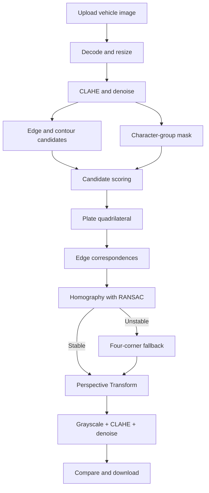

# Project Report Guide

## 1. Project title

**Vehicle License Plate Rectification for OCR Using OpenCV, Homography and RANSAC**

## 2. Problem statement

ภาพป้ายทะเบียนจากรถหรือกล้อง CCTV มักมีมุมเอียง แสงไม่สม่ำเสมอ และสัญญาณรบกวน ทำให้ OCR อ่านตัวอักษรได้ยาก โปรเจกต์นี้จึงตรวจหาป้ายจากภาพรถหนึ่งภาพ ปรับมุมมองให้ตรง และสร้างภาพ Grayscale ที่เพิ่ม Contrast และลด Noise แล้ว

## 3. Objectives

1. ตรวจหาบริเวณป้ายทะเบียนจากภาพรถหนึ่งภาพ
2. หาเส้นขอบและมุมของแผ่นป้าย โดยรองรับป้ายสีและมุมมองที่เอียงมาก
3. คำนวณ Homography จากจุดตามขอบด้วย RANSAC
4. ใช้ Perspective Transform เพื่อสร้างภาพป้ายที่มองตรง
5. เตรียมภาพ Grayscale สำหรับ OCR และแสดงผลก่อน–หลังบน Streamlit

## 4. System architecture

## 5. Core methods

Homography maps a point on the source plate to the rectified plane:

\[
s\begin{bmatrix}x' \\ y' \\ 1\end{bmatrix} =
\mathbf{H}\begin{bmatrix}x \\ y \\ 1\end{bmatrix},
\qquad \mathbf{H}\in\mathbb{R}^{3\times3}.
\]

The pipeline samples several correspondences along the detected plate edges. RANSAC estimates candidate homographies and rejects points whose reprojection error is too high. When there are not enough stable inliers, the application reports the condition and uses a four-corner perspective transform instead of presenting an unreliable RANSAC result.

Image preparation for OCR consists of:

- Grayscale conversion
- Bilateral filtering to reduce noise while preserving character edges
- CLAHE for local contrast enhancement
- Mild unsharp masking for clearer character strokes

## 6. Evaluation

Test with vehicle images that vary in:

| Factor | Suggested values |
|---|---|
| Viewing angle | Front, mild skew, strong skew |
| Plate color | White, yellow, colored graphics |
| Plate size | Near, medium, far |
| Lighting | Bright, normal, dark, reflected light |
| Image quality | Sharp, noisy, motion blur |

Record the selected bounding box, confidence score, RANSAC inlier count, processing time, and whether the final plate is visually rectified without cutting off characters.

## 7. Failure handling

- If no plate candidate is found, ask for a clearer or more tightly framed vehicle image.
- If the first candidate is incorrect, allow the user to choose another candidate.
- If automatic corners are inaccurate, allow manual coordinate correction.
- If RANSAC is unstable, use the disclosed four-corner fallback.
- Do not claim OCR accuracy because OCR is outside the core scope of this project.

## 8. Suggested five-person responsibility split

| Member | Primary responsibility | Presentation section |
|---|---|---|
| 1 | Requirements and test-image collection | Problem and objectives |
| 2 | Edge, contour and character-group detection | Plate localization |
| 3 | Corner refinement and candidate scoring | Keypoints and detection |
| 4 | RANSAC, homography and evaluation | Geometry and testing |
| 5 | Streamlit UI, deployment and documentation | Demo and conclusion |

## 9. Limitations and future work

- A trained license-plate detector would improve recall for very small, blurred or obstructed plates.
- A labeled Thai license-plate test set is needed for quantitative detection accuracy.
- OCR can be added later and evaluated separately from rectification quality.
- Video tracking can stabilize detections across CCTV frames.
