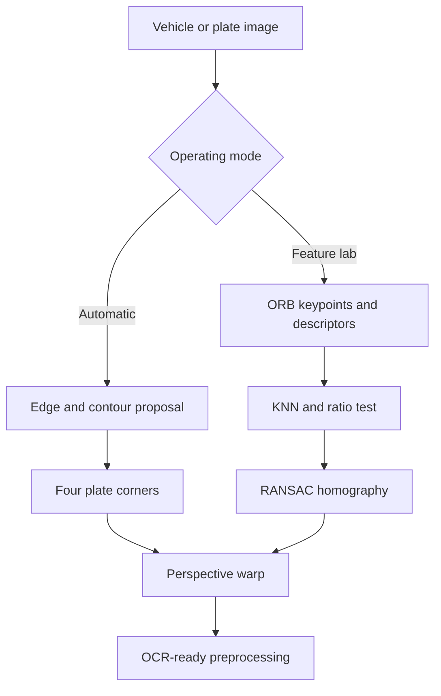

# Project Report Guide

## 1. Project title

**Vehicle Plate Rectification for LPR Using ORB Feature Matching and Homography**

## 2. Problem statement

License plates captured by roadside or CCTV cameras can contain perspective distortion. Character width, spacing and stroke direction become inconsistent, reducing the quality of images supplied to an OCR system. This project develops a web application that rectifies an angled planar plate into a frontal view and produces a high-contrast OCR-ready image.

## 3. Objectives

1. Detect or manually identify the four corners of a license plate in an angled vehicle image.
2. Extract and match ORB visual features between angled and frontal views of the same plate.
3. Estimate a robust 3 × 3 homography with RANSAC and reject incorrect matches.
4. Apply a perspective transformation and preprocessing suitable for later OCR.
5. Deploy an interactive public application that runs entirely in the browser.

## 4. System architecture

## 5. Core equations

For planar points, homography maps source point \(\mathbf{x}\) to destination point \(\mathbf{x}'\):

\[
s\begin{bmatrix}x' \\ y' \\ 1\end{bmatrix} =
\mathbf{H}\begin{bmatrix}x \\ y \\ 1\end{bmatrix},
\qquad \mathbf{H}\in\mathbb{R}^{3\times3}.
\]

The ratio test accepts the best descriptor match when:

\[
d_1 < r\,d_2,
\]

where \(d_1\) and \(d_2\) are the Hamming distances of the first- and second-nearest neighbors and the default ratio \(r\) is 0.75.

RANSAC repeatedly estimates candidate homographies from minimal point sets. A match is an inlier when its reprojection error is below the selected threshold, which defaults to 4 pixels.

## 6. Suggested evaluation

Create a small group-owned test set rather than evaluating only the built-in demo.

| Factor | Suggested values |
|---|---|
| Horizontal viewing angle | 0°, 15°, 30°, 45° |
| Distance / plate size | Near, medium, far |
| Lighting | Bright, normal, dark |
| Blur | None, mild, strong |
| Obstruction | None, partial |

Record these measurements for each feature-matching pair:

- Number of ORB keypoints in both images
- Good matches after the ratio test
- RANSAC inlier count
- Inlier ratio = inliers / good matches
- Whether the final rectification is visually correct
- Processing time measured with browser performance tools, if desired

## 7. Failure handling

- Fewer than four good matches: do not estimate a homography.
- Fewer than four RANSAC inliers: reject the result as geometrically unstable.
- No suitable automatic contour: ask the user to choose four corners manually.
- Wrong reference plate: explicitly report failure or a low inlier ratio.

## 8. Suggested five-person responsibility split

| Member | Primary responsibility | Presentation section |
|---|---|---|
| 1 | Problem, requirements and data collection | Problem and objective |
| 2 | Automatic plate proposal | Contours and corner detection |
| 3 | ORB and descriptor matching | Keypoints and ratio test |
| 4 | RANSAC, homography and testing | Geometry and evaluation |
| 5 | UI, Vercel deployment and documentation | Live demo and conclusion |

All members should still understand the entire pipeline because questions may not follow the assigned presentation sections.

## 9. Limitations and future work

- Replace contour proposals with a trained plate detector for small or borderless plates.
- Collect a Thai license-plate dataset with annotations across multiple camera conditions.
- Add Thai OCR and report character recognition accuracy after rectification.
- Compare ORB against SIFT in an offline Python experiment.
- Add video frame tracking to stabilize the detected plate over time.
